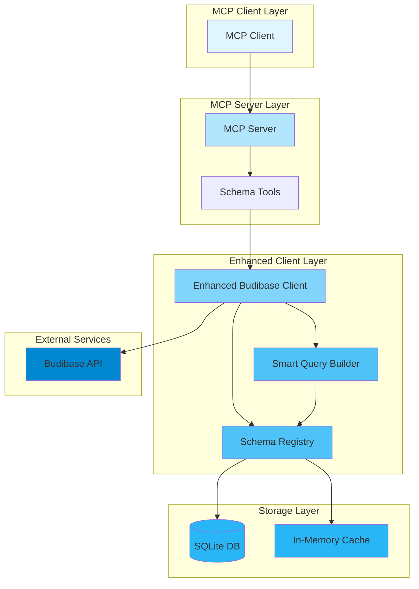

# Budibase MCP Server - Schema Registry Architecture

## Visual Architecture Diagram



## Data Flow

### 1. Schema Synchronization Flow
```
Client Request → Sync Tool → Enhanced Client → Budibase API
                                     ↓
                            Schema Registry → SQLite Storage
                                     ↓
                            Event: schemaChanged
```

### 2. Query Validation Flow
```
Query Request → Validate Tool → Smart Query Builder
                                        ↓
                               Schema Registry (Cache)
                                        ↓
                                Validated Query
                                        ↓
                               Budibase API Call
```

### 3. Auto-Sync Flow
```
Timer Interval → Enhanced Client → Check Last Sync
                                         ↓
                               Needs Sync? → Budibase API
                                         ↓
                                Schema Registry Update
```

## Key Benefits Visualization

```
┌─────────────────────────────────────────────────────┐
│                   Before Enhancement                 │
├─────────────────────────────────────────────────────┤
│ Every Query:                                        │
│ 1. Call API for schema ────────────► API           │
│ 2. Build query         ────────────► API           │
│ 3. Execute query       ────────────► API           │
│                                                     │
│ Result: 3+ API calls per operation                 │
└─────────────────────────────────────────────────────┘

┌─────────────────────────────────────────────────────┐
│                   After Enhancement                  │
├─────────────────────────────────────────────────────┤
│ First Time:                                         │
│ 1. Sync schemas once   ────────────► API           │
│                               ↓                     │
│                        Local Storage                │
│                                                     │
│ Subsequent Queries:                                 │
│ 1. Validate locally    ← Local Cache               │
│ 2. Execute query       ────────────► API           │
│                                                     │
│ Result: 1 API call per operation                   │
└─────────────────────────────────────────────────────┘
```

## Component Responsibilities

### Schema Registry
- Persistent storage management
- Cache coordination
- Version tracking
- Change detection
- Event emission

### Smart Query Builder
- Query validation
- Field type checking
- Query optimization
- Natural language processing
- Suggestion generation

### Enhanced Client
- Orchestration layer
- Auto-sync management
- Backwards compatibility
- Error handling
- Resource cleanup

## Database Schema

```sql
-- Applications Table
CREATE TABLE applications (
    app_id TEXT PRIMARY KEY,
    name TEXT NOT NULL,
    url TEXT,
    status TEXT,
    last_synced DATETIME,
    metadata TEXT
);

-- Tables Table
CREATE TABLE tables (
    table_id TEXT PRIMARY KEY,
    app_id TEXT NOT NULL,
    name TEXT NOT NULL,
    type TEXT,
    schema TEXT NOT NULL,
    last_synced DATETIME,
    FOREIGN KEY (app_id) REFERENCES applications(app_id)
);

-- Schema Versions Table
CREATE TABLE schema_versions (
    id INTEGER PRIMARY KEY,
    table_id TEXT NOT NULL,
    version INTEGER NOT NULL,
    schema TEXT NOT NULL,
    checksum TEXT NOT NULL,
    created_at DATETIME,
    FOREIGN KEY (table_id) REFERENCES tables(table_id)
);
```
